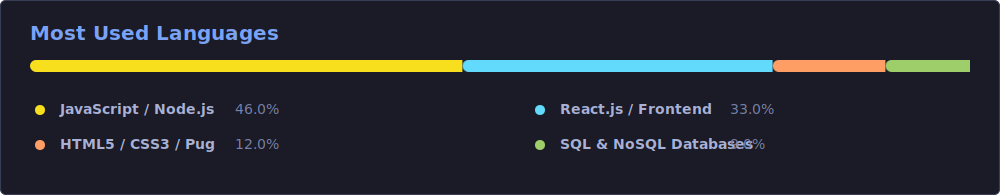

# Hi there, I'm Bhargava Gidijala! 👋

  

  
  
  

---

### 🚀 About Me

I am a driven **Full-Stack Software Engineer** with 3+ years of experience specialized in building high-throughput backend ecosystems, secure financial architectures, and intelligent workflow automations[cite: 1]. I enjoy writing clean code, designing robust RESTful microservices, and integrating AI acceleration tools to cut down production deployment times[cite: 1].

*   **Scope of Expertise:** Engineered end-to-end full-stack workflows for loan processing (LAP/LAS) with integrated credit validation engines[cite: 1].
*   **Security Architecture:** Expert in handling sensitive data using AES-256 encryption systems and resilient JWT rotation strategies[cite: 1].

---

### 📌 Current Status & Focus

🔭 **I’m currently working on:** Building scalable web applications using Node.js, Express.js, MongoDB, and React.js[cite: 1].
 

👯 **I’m looking to collaborate on:** Fintech backend microservices, robust API integrations, and secure payment processing systems.
 

🤝 **I’m looking for help with:** Expanding CI/CD workflow automation pipelines and optimizing large-scale cloud deployments[cite: 1].
 

🌱 **I’m currently learning:** Advanced AI-assisted development tools and running local LLMs using Ollama[cite: 1].
 

💬 **Ask me about:** MERN Stack development, JWT authentication, AES-256 data encryption, and building automated chatbots using Botpress[cite: 1].
 

⚡ **Fun fact:** I love accelerating product delivery using modern tooling[cite: 1], but my favorite tool is still a perfectly optimized database query!

---

### 🛠️ Tech Stack & Tooling

#### 💻 Frontend Development

  
  
  
  
  
  

#### ⚙️ Backend & Architecture

  
  
  
  
  

#### 🗄️ Database Management

  
  
  

#### 🤖 AI, Automation & Platforms

  
  
  

#### 🚀 DevOps & Tooling

  
  
  
  
  

#### 💻 Operating Systems

  
  

---

### 📂 Featured Implementations

<table>
  <tr>
    <td width="50%" valign="top">
      <h4>💳 FinxBridge Ecosystem</h4>
      <ul>
        <li>Orchestrated full-stack architectures for complex loan instruments (LAP/LAS/Carmudi)[cite: 1].</li>
        <li>Automated core underwriting flows using PAN/Aadhaar integrations, decreasing manual field entry errors by 15%[cite: 1].</li>
      </ul>
    </td>
    <td width="50%" valign="top">
      <h4>🍕 Flavora Engine</h4>
      <ul>
        <li>Engineered an enterprise authentication system utilizing production-grade OAuth, SMS/Email OTP, and strict JWT rotation[cite: 1].</li>
        <li>Programmed dynamic invoice generators and configured continuous deployment pipelines via Render[cite: 1].</li>
      </ul>
    </td>
  </tr>
  <tr>
    <td width="50%" valign="top">
      <h4>🤖 Muskaan & Spinebot Automation</h4>
      <ul>
        <li>Designed highly conversational customer interaction interfaces using Botpress and raw Node.js handlers[cite: 1].</li>
        <li>Wired chatbot pipelines directly into relational engines (MySQL) to pull real-time client variables automatically[cite: 1].</li>
      </ul>
    </td>
    <td width="50%" valign="top">
      <h4>🔒 Visa Security Wrapper</h4>
      <ul>
        <li>Deployed deep backend optimizations for visa registration workflows handling international travelers[cite: 1].</li>
        <li>Secured sensitive candidate payload structures via targeted AES-256 data packet encryption pipelines[cite: 1].</li>
      </ul>
    </td>
  </tr>
</table>

---

### 📊 GitHub Diagnostics & Statistics

#### ⚡ Engineering Metrics at a Glance
- 🛠️ **Production Systems:** Deployed & optimized full-stack products handling high-volume fintech transaction payloads.
- 🚀 **Agile Delivery:** Leveraged AI-assisted pipelines (GitHub Copilot) and microservices to accelerate deployment cycles by 25%[cite: 1].
- 🔏 **Code Reliability:** Maintained robust production standards using strict data sanitization, AES-256 encryption, and automated CI/CD builds[cite: 1].

  
  

  

---

#### 📊 Real-World Language Distribution

<table>
  <tr>
    <td width="25%"><b>JavaScript / Node.js</b></td>
    <td width="75%">
      <svg width="100%" height="16" xmlns="http://www.w3.org/2000/svg">
        <defs>
          <linearGradient id="js-grad" x1="0%" y1="0%" x2="100%" y2="0%">
            <stop offset="0%" stop-color="#1A1B26" />
            <stop offset="100%" stop-color="#7AA2F7" />
          </linearGradient>
        </defs>
        <rect width="100%" height="16" rx="8" fill="#16161E" />
        <rect width="92%" height="16" rx="8" fill="url(#js-grad)">
          <animate attributeName="width" from="0%" to="92%" dur="1.2s" fill="freeze" />
        </rect>
        <text x="94%" y="12" fill="#7AA2F7" font-size="11" font-family="monospace" font-weight="bold">92%</text>
      </svg>
    </td>
  </tr>
  <tr>
    <td><b>React.js / Frontend</b></td>
    <td>
      <svg width="100%" height="16" xmlns="http://www.w3.org/2000/svg">
        <defs>
          <linearGradient id="react-grad" x1="0%" y1="0%" x2="100%" y2="0%">
            <stop offset="0%" stop-color="#1A1B26" />
            <stop offset="100%" stop-color="#2ac3de" />
          </linearGradient>
        </defs>
        <rect width="100%" height="16" rx="8" fill="#16161E" />
        <rect width="85%" height="16" rx="8" fill="url(#react-grad)">
          <animate attributeName="width" from="0%" to="85%" dur="1.2s" fill="freeze" />
        </rect>
        <text x="87%" y="12" fill="#2ac3de" font-size="11" font-family="monospace" font-weight="bold">85%</text>
      </svg>
    </td>
  </tr>
  <tr>
    <td><b>HTML5 / CSS3 / Pug</b></td>
    <td>
      <svg width="100%" height="16" xmlns="http://www.w3.org/2000/svg">
        <defs>
          <linearGradient id="html-grad" x1="0%" y1="0%" x2="100%" y2="0%">
            <stop offset="0%" stop-color="#1A1B26" />
            <stop offset="100%" stop-color="#ff9e64" />
          </linearGradient>
        </defs>
        <rect width="100%" height="16" rx="8" fill="#16161E" />
        <rect width="72%" height="16" rx="8" fill="url(#html-grad)">
          <animate attributeName="width" from="0%" to="72%" dur="1.2s" fill="freeze" />
        </rect>
        <text x="74%" y="12" fill="#ff9e64" font-size="11" font-family="monospace" font-weight="bold">72%</text>
      </svg>
    </td>
  </tr>
  <tr>
    <td><b>SQL / NoSQL Datastores</b></td>
    <td>
      <svg width="100%" height="16" xmlns="http://www.w3.org/2000/svg">
        <defs>
          <linearGradient id="db-grad" x1="0%" y1="0%" x2="100%" y2="0%">
            <stop offset="0%" stop-color="#1A1B26" />
            <stop offset="100%" stop-color="#9ece6a" />
          </linearGradient>
        </defs>
        <rect width="100%" height="16" rx="8" fill="#16161E" />
        <rect width="80%" height="16" rx="8" fill="url(#db-grad)">
          <animate attributeName="width" from="0%" to="80%" dur="1.2s" fill="freeze" />
        </rect>
        <text x="82%" y="12" fill="#9ece6a" font-size="11" font-family="monospace" font-weight="bold">80%</text>
      </svg>
    </td>
  </tr>
</table>

 
