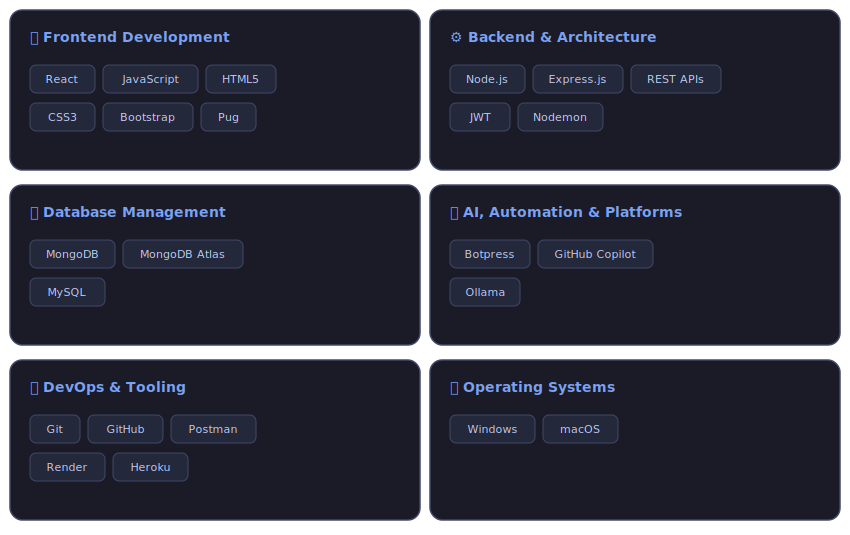

# Hi there, I'm Bhargava Gidijala! 👋

  

  
  
  
  

---

### 🚀 About Me

I am a driven **Full-Stack Software Engineer** with 3+ years of experience specialized in building high-throughput backend ecosystems, secure financial architectures, and intelligent workflow automations. I enjoy writing clean code, designing robust RESTful microservices, and integrating AI acceleration tools to cut down production deployment times.

*   **Scope of Expertise:** Engineered end-to-end full-stack workflows for loan processing (LAP/LAS) with integrated credit validation engines.
*   **Security Architecture:** Expert in handling sensitive data using AES-256 encryption systems and resilient JWT rotation strategies.

---

### 📌 Current Status & Focus

🔭 **I’m currently working on:** Building scalable web applications using Node.js, Express.js, MongoDB, and React.js.
 

👯 **I’m looking to collaborate on:** Fintech backend microservices, robust API integrations, and secure payment processing systems.
 

🤝 **I’m looking for help with:** Expanding CI/CD workflow automation pipelines and optimizing large-scale cloud deployments.
 

🌱 **I’m currently learning:** Advanced AI-assisted development tools and running local LLMs using Ollama.
 

💬 **Ask me about:** MERN Stack development, JWT authentication, AES-256 data encryption, and building automated chatbots using Botpress.
 

⚡ **Fun fact:** I love accelerating product delivery using modern tooling, but my favorite tool is still a perfectly optimized database query!

---

### 🛠️ Core Tech Stack & Engineering Ecosystem

#### 🛠️ Next-Gen IDEs, AI Assistants & Productivity Tooling

              

---

### 📂 Featured Implementations

---

### 📂 Featured Implementations

| 🌐 [Flavora Engine](https://gbr-kitchen.onrender.com/) | 📱 [Mobile Storage Application](https://gbr-mobile-seize-application.onrender.com/) |
| :--- | :--- |
| • Engineered an enterprise authentication system utilizing production-grade OAuth, SMS/Email OTP, and strict JWT rotation. • Programmed dynamic invoice generators and configured continuous deployment pipelines via Render. | • Designed and optimized custom full-stack architecture for mobile hardware asset tracking, cloud allocation, and data state-holding backend microservices. |

| 🪙 [Crypto Currency Tracker](https://gbr-cryptocurrency.onrender.com/) | 👤 [Personal Webpage](https://gbr-pwebpage.onrender.com/) |
| :--- | :--- |
| • Constructed interactive, high-throughput digital asset trackers displaying real-time coin metrics, historical charting data, and currency conversions. | • Designed and executed a highly responsive, modern performance portfolio to display active system metrics, active deployments, and engineering credentials. |

---

### 📊 GitHub Diagnostics & Statistics

#### ⚡ Engineering Metrics at a Glance
- 🛠️ **Production Systems:** Deployed & optimized full-stack products handling high-volume fintech transaction payloads.
- 🚀 **Agile Delivery:** Leveraged AI-assisted pipelines (GitHub Copilot) and microservices to accelerate deployment cycles by 25%.
- 🔏 **Code Reliability:** Maintained robust production standards using strict data sanitization, AES-256 encryption, and automated CI/CD builds.

  
  

  

---

### 🔗 Live Production Deployments

* **🍳 Flavora (Online Restaurant System):** [gbr-kitchen.onrender.com](https://gbr-kitchen.onrender.com/)
* **📦 Mobile Storage Application:** [gbr-mobile-seize-application.onrender.com](https://gbr-mobile-seize-application.onrender.com/)
* **📈 Crypto Currency Dashboard:** [gbr-cryptocurrency.onrender.com](https://gbr-cryptocurrency.onrender.com/)
* **💼 Personal Portfolio Webpage:** [gbr-pwebpage.onrender.com](https://gbr-pwebpage.onrender.com/)

---
